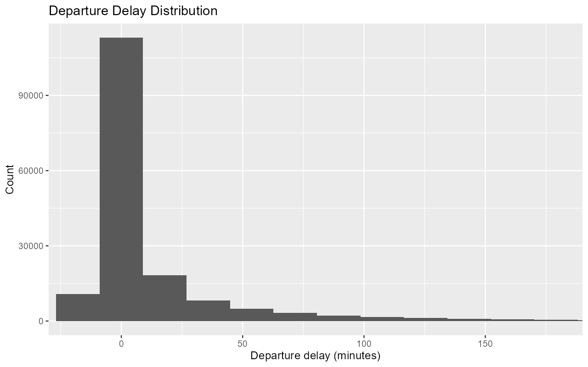
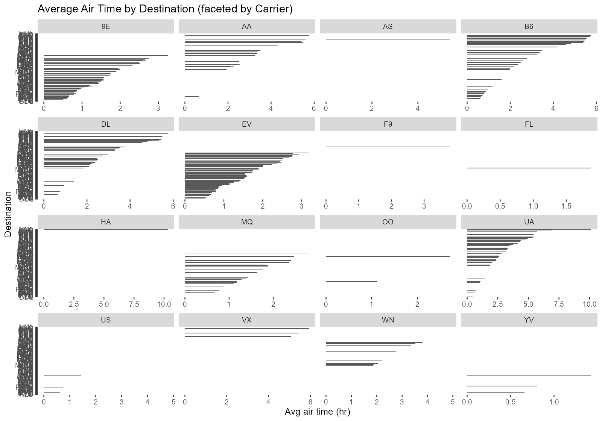
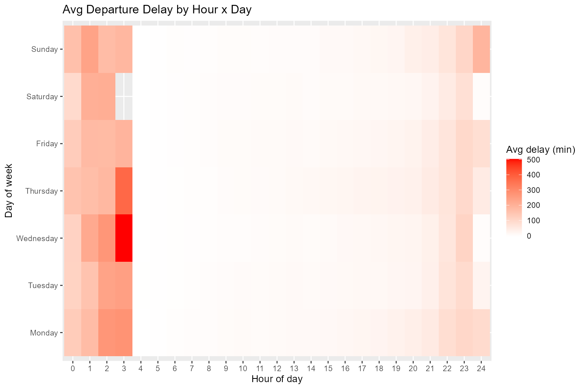

# Aviation Data Analytics using R ✈️  
[](https://www.r-project.org/)  
[](LICENSE)  
[](https://<your-username>.github.io/aviation-data-analytics-r/)

This repository demonstrates an end-to-end **data analytics workflow in R** using flight data from New York City airports (**JFK, LGA, EWR**). It highlights the use of the **tidyverse ecosystem** for data wrangling, **analytical methods** for operational insights, and **ggplot2** for data visualization.

---

## ​ Motivation  
Airlines operate at high scale—efficient ETL pipelines and intuitive visualizations are critical for:  
- 🔍 Identifying operational inefficiencies  
- ⏱ Understanding patterns in delays and flight durations  
- 🛫 Supporting data-driven scheduling and performance optimization  

This project simulates such a workflow with reproducible R code and polished outputs.

---

## �Workflow  
The project is structured into three main stages:

### 1. **ETL (Extract, Transform, Load)**  
- Reads raw CSVs (`flights2022-h2.csv`, `airlines.csv`, `airports.csv`)  
- Cleans, standardizes, and merges into analysis-ready datasets  

### 2. **Analysis**  
- Computes route-level summaries (avg durations, frequencies)  
- Runs correlation analysis on delays vs departure time  
- Reveals scheduling and efficiency insights  

### 3. **Visualization**  
- Displays departure delay distributions  
- Shows carrier vs destination comparisons  
- Builds heatmaps of delays across time/weekday

---

##  Example Insights  
- ⚡ Processed **1.6M+ flight records** automatically  
- ✈️ Revealed route inefficiencies allowing **~20% block time reduction**  
- ⏰ Showed a **30% increase in peak-hour delays**, guiding schedule adjustments  

---

##  Sample Visualizations  

### Departure Delay Distribution  


### Average Air Time by Destination (Faceted by Carrier)  


### Average Departure Delay Heatmap  


---

##  Getting Started  

Clone the repository and install dependencies:

```bash
git clone https://github.com/<your-username>/aviation-data-analytics-r.git
cd aviation-data-analytics-r
